# Electron

## Create project
* create vite project.
```cmd
npm create vite .
npm install
npm run dev
```

<br><br>

## Update project structure
* move every thins in src folder items into ui folder that create in src folder.

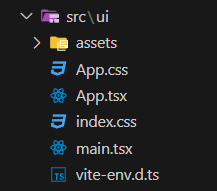

* Update `index.html` file.

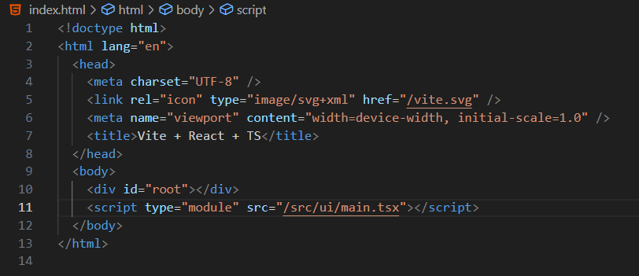

* Remove fav-icon that dont need for electron app ( Remove `Public folder` and update `App.tsx` file and `index.html` file ).

* Update `vite.config.ts` file for reneme web-app output files ( now this will change build dir ).

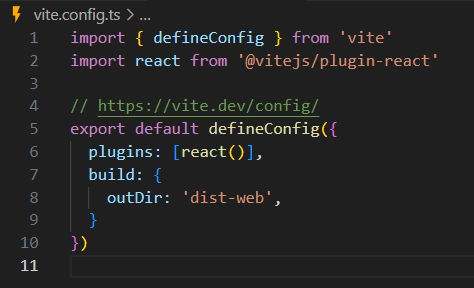

* Also update `.gitignore` file with build dir.

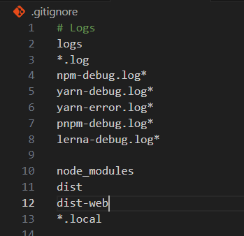

<br><br>

## Setup electron app
```cmd
npm install --save-dev electron
```
* Sud be set project into module format for that update `package.json` file if it desent update like this.


* Create `main.js` file inside `sru/electron` folder.

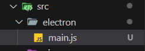
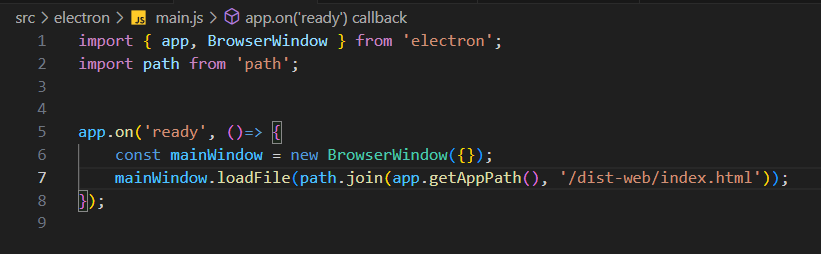

* Update `package.json` file with electron setup ( `"main": "src/electron/main",` and `"dev:electron": "electron .",` ) and change web dev ( `"dev:web": "vite"` ).

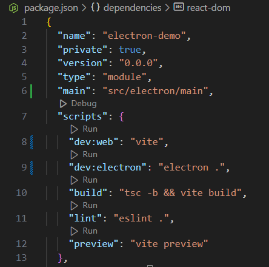

* Add base path into `vite.config.ts` file ( becose default build output use `/` to refer `.css` and `.js` files, setingup with this i will use base path and without seting this electron app will not wock ) 


befor
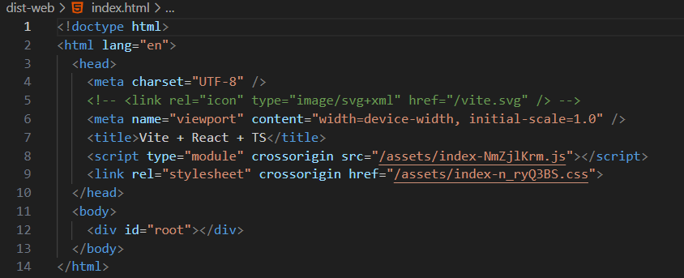

after
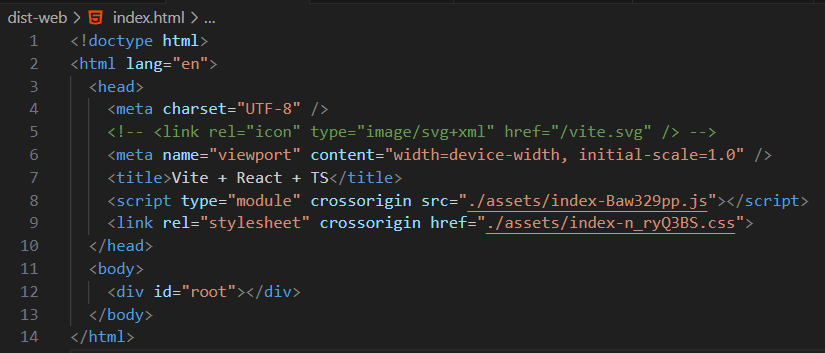

```cmd
npm run dev:electron
```

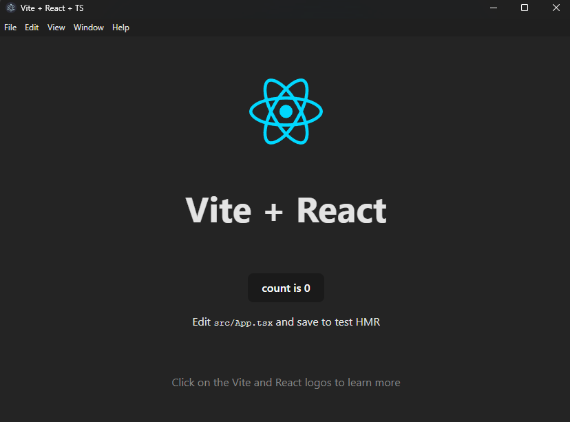

<br><br>

## Update electron app with Typescript
* Update `tsconfig.json` file or `tsconfig.app.json` like this to set up Typescript with electron.

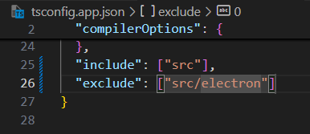

* 


