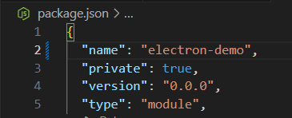

# Electron A-Z Setup

In this repo setup, the Electron app step by step uses React with Typescript and creates it using Vite.

If you use this to set up your Electron app or your Webapp to set up with electron, follow these steps and if you need to create it from scratch but need to use other web technologies like Angular, Vue, or Svelte, you can set it up.

## Create project
* Create Vite project.
```cmd
npm create vite .
```

* Install packages.
```cmd
npm install
```

* Run projects.
```cmd
npm run dev
```

<br><br>

## Update project structure
* Move everything in the `src` folder items into the `ui` folder that is created in the src folder.


* Update `index.html` file.


* Remove favicons that aren't needed for the electron app ( Remove the `Public folder` and update the `App.tsx` file and `index.html` file ).

* Update the `vite.config.ts` file to rename web-app output files ( now this will change the build dir ).


* Also, update the `.gitignore` file with build dir.


<br><br>

## Setup electron app
```cmd
npm install --save-dev electron
```
* Should be set to project into module format for that update `package.json` file if it doesn't update like this.



* Create a `main.js` file inside the `src/electron` folder.


* Update `package.json` file with electron setup ( `"main": "src/electron/main",` and `"dev:electron": "electron .",` ) and change web dev ( `"dev:web": "vite"` ).


* Add base path into `vite.config.ts` file ( because default build output use `/` to refer to `.css` and `.js` files, setting up with this, it will use base path, and without setting this electron app will not work ).


Before


After


```cmd
npm run dev:electron
```


<br><br>

## Update electron app with typescript
* Update the `tsconfig.json` file or `tsconfig.app.json` like this to set up Typescript with electron.


* 


