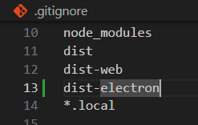
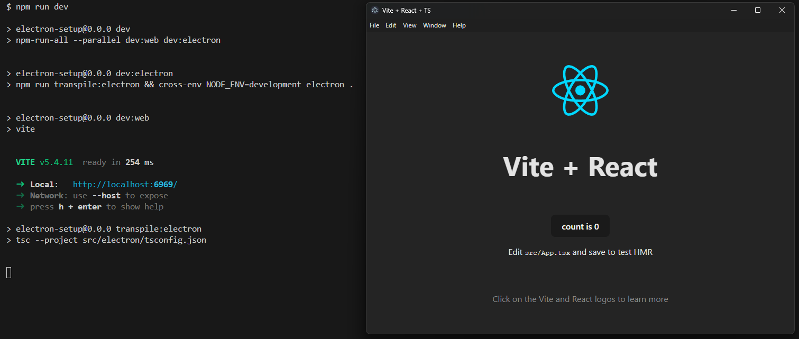

# Electron A-Z Setup

In this repo setup, the Electron app step by step uses React with Typescript and creates it using Vite.

If you use this to set up your Electron app or your Webapp to set up with electron, follow these steps and if you need to create it from scratch but need to use other web technologies like Angular, Vue, or Svelte, you can set it up.

## Create project
* Create Vite project.
    ```cmd
    npm create vite .
    ```

* Install packages.
    ```cmd
    npm install
    ```

* Run projects.
    ```cmd
    npm run dev
    ```

<br><br>

## Update project structure
* Move everything in the `src` folder items into the `ui` folder that is created in the src folder.

    

* Update `index.html` file.

    

* Remove favicons that aren't needed for the electron app ( Remove the `Public folder` and update the `App.tsx` file and `index.html` file ).

* Update the `vite.config.ts` file to rename web-app output files ( now this will change the build dir ).

    

* Also, update the `.gitignore` file with build dir.

    

<br><br>

## Setup electron app
```cmd
npm install --save-dev electron
```
* Should be set to project into module format for that update `package.json` file if it doesn't update like this.

    

* Create a `main.js` file inside the `src/electron` folder.

    
    

* Update `package.json` file with electron setup ( `"main": "src/electron/main",` and `"dev:electron": "electron .",` ) and change web dev ( `"dev:web": "vite"` ).

    

* Add base path into `vite.config.ts` file ( because default build output use `/` to refer to `.css` and `.js` files, setting up with this, it will use base path, and without setting this electron app will not work ).

    

Before
    

After
    

Run electron app
```cmd
npm run dev:electron
```


<br><br>

## Update electron app with typescript
* Update the `tsconfig.json` file or `tsconfig.app.json` like this to set up Typescript with electron.

    

* Create a new `tsconfig.json` file for the electron ( create it inside the `src/electron` folder ). 

    

* Update `package.json` for setup electron with typescript ( adding `transpile:electron` part and resetting `main` in `package.json` ).

    

* Update `.gitignore` with electron output `dis-electron`.

    

<br><br>

## Setup electron builder
* Install electron builder.
    ```cmd
    npm install --save-dev electron-builder
    ```

* Create and setup `electron-builder.json` configs also it should create in the project root ( `\` ) and add the desktop icon `.png` ( `desktop Icon.png` ) to avoid windows build errors.

    
    

* Update `package.json` to build an electron desktop app for a specific OS and update `"main": "dist-electron/main.js"` this `main` value with `main.js.
* Also, you must run the build command in administrator mode and make sure you are targeting the system you are using right now. 

    

* Run specific commands that work for your OS.

    Windows
    ```cmd
    npm run dist:win
    ```

    Mac OS
    ```cmd
    npm run dist:mac
    ```

    Linux
    ```cmd
    npm run dist:linux
    ```

<br><br>

## Setup dev env
* Setup vite HMR ( Hot Module Reloading ) for development and pre-build application in production.

    ```cmd
    npm install --save-dev cross-env
    ```

* Update the `package.json` file with `"dev:electron"` command.

    

* Add this function to create a new file called `util.ts` inside the `src/electron` folder.

    

* Set up the HMR ( Hot Module Reloading ) server updating the `vite.config.ts` file and setting the `.env` file for configer `DEV_PORT`.

    ```cmd
    npm install --save-dev dotenv
    ```

    

    

* Update the `main.ts` file in the `src/electron` folder to setup and run dev mode and production using `.env` to get `DEV_PORT`.

    

* Install `npm-run-all` to run the electron app and web app same time in dev mode.

    ```cmd
    npm install --save-dev npm-run-all
    ```

* Update the `package.json` file to set up `npm-run-all` by changing `dev:electron` and adding `dev`.

    

    ```cmd
    npm run dev
    ```

    


